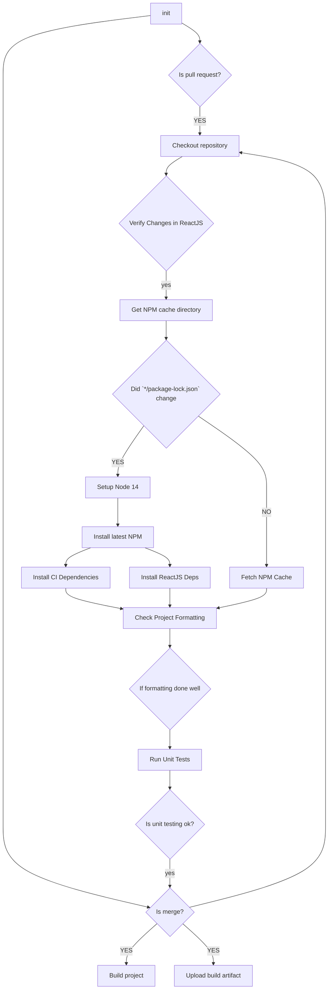

```mermaid
graph TD
  init --> isPR
  init --> isMerge
  isPR{Is pull request?} --> |YES| checkout[Checkout repository]
  isMerge{Is merge?} --> checkout
  checkout --> isReactChanged{Verify Changes in ReactJS}
  isReactChanged --> |yes| getCache[Get NPM cache directory]
  getCache --> didChange{Did `*/package-lock.json` change}
  didChange --> |YES| setupNode[Setup Node 14]
  setupNode --> installNpm[Install latest NPM]
  didChange --> |NO| fetchCache[Fetch NPM Cache]
  installNpm --> installCi[Install CI Dependencies]
  installNpm --> installReactJS[Install ReactJS Deps]
  installCi --> checkFormats[Check Project Formatting]
  installReactJS --> checkFormats
  fetchCache --> checkFormats
  checkFormats --> isFormatOK{If formatting done well}
  isFormatOK --> unitTests[Run Unit Tests]
  unitTests --> isUnitTestsOk{Is unit testing ok?}
  isUnitTestsOk --> |yes| isMerge
  isMerge --> |YES| build[Build project]
  isMerge --> |YES| uploadBuild[Upload build artifact]

```