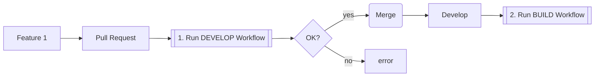
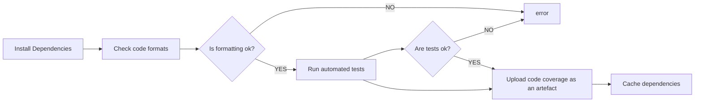
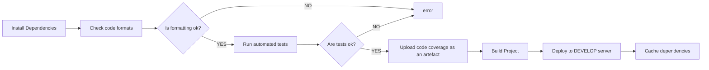

# CI/CD Workflow

## 1. Run DEVELOPMENT Workflow

  - install dependencies
  - check code formatting
  - run automated tests
  - upload code coverage as an artifact
  - cache dependencies

## 2. Run BUILD Workflow

  - install dependencies
  - check code formatting
  - run automated tests
  - upload code coverage as an artifact
  - build project
  - upload build as an artifact
  - deploy to DEVELOP server
  - cache dependencies